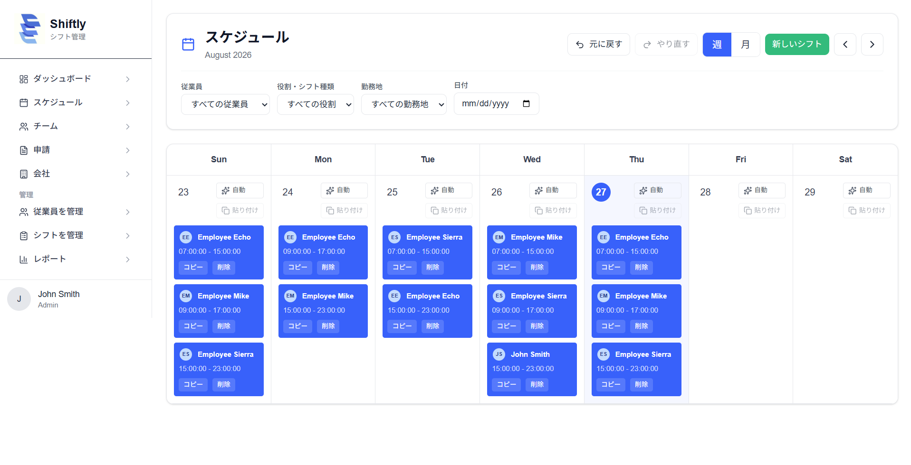
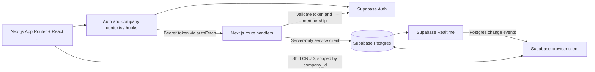

# Shiftly

Shiftly is a shift scheduling and team coordination app for small teams. It brings company setup, staff scheduling, employee requests, and team information into one workspace, so managers and employees can work from the same company schedule.

> **Portfolio project** · Next.js, TypeScript, Supabase



## Features

- Create a company or join one with a join code; switch between companies your account belongs to.
- Create, edit, assign, filter, copy, undo, and redo shifts in week and month views.
- Submit time-off and shift-swap requests; managers can review and update request status.
- Manage company members and roles, view a dashboard, and see notifications and recent activity.
- Sign up with email and password or Google; switch the interface between English and Japanese.

## Architecture



The App Router provides the application shell and API endpoints. Client components hold session and selected-company state in React contexts, while hooks load feature data. `authFetch` adds the current Supabase access token to API requests. Route handlers validate that token with Supabase Auth, validate request fields, check membership or privileged roles, and then perform their database operation with a server-side service-role client.

Shift data follows a separate path: `useShifts` queries and mutates `shifts` with the public browser client and subscribes to Postgres changes. It filters loaded rows by the selected company and ignores realtime events for other companies in the client. Database Row Level Security (RLS) must therefore correctly protect direct browser queries and writes; the UI filter alone is not an authorization boundary.

## Engineering notes

- **Company-scoped access:** Membership records associate users and companies with a role. API handlers take a company ID, then check membership for reads and privileged membership (`admin`, `manager`, or `owner`) for administrative operations. Request creation is limited to a member; request listing is further scoped to the requester for non-privileged roles. **Learning:** carrying a tenant ID in a request is not proof of access; resolve it against the signed-in user’s membership.
- **Separate browser and server credentials:** The browser client uses the public anon key. API handlers verify the bearer token first and keep the service-role key on the server. The helper also rejects a service key that matches the public key. Because service-role access bypasses RLS, each API route must enforce its own authorization before querying or mutating data. **Learning:** privileged server credentials make explicit per-route authorization essential.
- **RLS policy recursion:** A migration replaces recursive membership-table policy checks with a `SECURITY DEFINER` membership lookup function. Its fixed `search_path` and restricted execute grants make the policy check independent of the table policy recursion it resolves. **Learning:** policies that query the table they protect can recurse; a narrowly scoped helper can break that dependency.
- **Auth and request reliability:** The auth context and `authFetch` handle session lookup timeouts and failed refreshes. Member loading deduplicates concurrent requests by company ID. The commit history shows these areas needed follow-up fixes for auth redirects/timeouts and duplicate requests. **Learning:** session state and repeated component fetches need deliberate handling around navigation and loading states.
- **Database compatibility:** The shift hook retries a write with a reduced set of columns for certain PostgREST missing-column errors and stores assignments in `shift_assignments` when available. That fallback helps explain the current schema assumptions, but does not replace a single documented schema migration path. **Learning:** defensive compatibility code is useful during schema evolution, while a reproducible schema remains the better long-term contract.

## Tech stack

- **Frontend:** Next.js 16 App Router, React 19, TypeScript, Tailwind CSS 4
- **Backend and data:** Next.js route handlers, Supabase Auth, Postgres, RLS, Realtime
- **UI and localization:** Framer Motion, Lucide, `next-intl`
- **Email:** Resend (used by the company-member API flow)

## Project structure

| Path | Purpose |
| --- | --- |
| `app/` | App Router pages, shared layout, and API route handlers |
| `app/src/pages/` | Feature screens: schedule, dashboard, team, requests, setup, and settings |
| `app/src/components/` | Shared layout, navigation, shift editor, and schedule details |
| `app/src/contexts/` | Authentication, selected company, and locale state |
| `app/src/hooks/` | Data loading and feature operations for shifts, requests, roles, and members |
| `app/api/` | Server-side endpoints for company, membership, profile, request, and notification operations |
| `lib/` | Supabase clients, authenticated fetch, API security checks, and input sanitization |
| `public/` | Static assets, including the app logo |

## Local setup

### Prerequisites

- Node.js and npm
- A Supabase project with the application’s base tables and RLS policies configured
- Google OAuth configured in Supabase only if you want to use Google sign-in

### Run the app

1. Install dependencies:

   ```bash
   npm install
   ```

2. Create `.env.local` with the Supabase project URL and public anon key:

   ```dotenv
   NEXT_PUBLIC_SUPABASE_URL=https://your-project.supabase.co
   NEXT_PUBLIC_SUPABASE_ANON_KEY=your-supabase-anon-key
   SUPABASE_SERVICE_ROLE_KEY=your-server-only-service-role-key
   ```

   Keep the service-role key private; do not prefix it with `NEXT_PUBLIC_`. The route handlers require it for server-side database work. The company-member email flow also reads `RESEND_API_KEY`, `RESEND_FROM_EMAIL`, and `NEXT_PUBLIC_APP_URL`.

3. Start the development server:

   ```bash
   npm run dev
   ```

4. Open [http://localhost:3000](http://localhost:3000).


## Limitations and next steps

- The repository does not include the full base database schema, so a fresh Supabase project cannot be initialized from the checked-in migrations alone.
- Browser-side shift mutations and realtime behavior depend on correctly configured RLS and Realtime publication settings in Supabase. The repository’s checked-in migrations do not document all policies for those tables.
- The README’s setup could be made reproducible with a complete schema/policy migration set and documented Supabase auth callback settings.
- Add screenshots of the schedule and dashboard to make the project easier to review.
